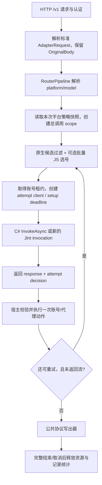

# 宿主运行流程：从启动到最后一个字节

本文按当前源码解释 C#/JS 共用的执行链，不描述尚未实现的理想架构。开发流程见 JS 教程（参见 `Rouer-Plugins-js/sdk/js/DEVELOPMENT.md`）、C# 教程（参见 `Rouer-Plugins-Csharp/sdk/csharp/DEVELOPMENT.md`）；API 细节见 JS API（参见 `Rouer-Plugins-js/sdk/js/API.md`）。

## 1. 先区分身份与生命周期

| 名称 | 谁产生 | 有效范围 |
| --- | --- | --- |
| pluginKey / manifest.id | 插件包声明，宿主绑定 | 长期账号归属、安装目录 |
| platform | 包内平台声明 | 模型路由、平台级策略/缓存 |
| pluginVersion | 清单/程序集版本 | 操作者识别发行版，不是资源权限 |
| generationId | 每次 JS 包加载 | 本次版本的运行上下文 |
| traceId | 宿主请求链 | 一个下游请求及其多次尝试 |
| invocationId | JS 调用入口 | 一次独立引擎调用 |
| source/client handle | 原生 invocation | 一次调用及其移交后的流生命周期，不能跨调用 |
| job ID | 本版本 job manager | 当前包版本的任务及有界完成历史 |

**包版本常驻 ≠ JS Engine 常驻。** 预解析程序可复用，已执行的 Engine/JsValue 不在请求间共享。C# 插件实例常驻也不意味着可以把 HttpResponseMessage 提前释放。

## 2. 进程启动与依赖注入

入口：[Program.cs](../src/Router.Host/Program.cs)、[基础设施注册](../src/Router.Infrastructure/DependencyInjection.cs)。

```text
创建 WebApplicationBuilder
  → 加载默认配置 + ROUTER2API_ 环境变量 + UserSecrets + 工作目录 Config/Config.json
  → 注册认证、配置、基础设施、路由、插件目录和后台服务
  → Build 宿主
  → 确保配置文件 / 迁移管理员密码格式 / SQLite CodeFirst 初始化
  → PluginCatalog.ReloadAsync(null)
  → 注册中间件、模型 API、插件端点、前端静态资源
  → app.Run，托管调度器开始工作
```

当前附加配置顺序中，`Config/Config.json` 在后，优先级高于对应用户机密/环境变量。`Config` 路径由当前工作目录决定；插件根目录由 `AppContext.BaseDirectory` 决定。使用 Docker、服务管理器或 `dotnet run` 时首先检查这两个位置。

主要宿主服务：

- SQLite 保存账号事实、日志、动态 origin 授权；启动会增量补齐表结构。
- Redis 提供插件共享短期状态、任务锁和代理策略；不要假定“本地状态可用”代表 Redis 正常。
- `ProxyTransportFactory` 持有物理连接池；`ProxyPoolHttpClientFactory` 负责无账号代理选择；`PluginHttpClient` 属于一次模型尝试。
- `PluginResiliencePipelines` 集中持有固定名称的 Polly v8 pipeline，不为每次调用构造一个无限 key 的策略。
- `PluginHostFactory` 给每个包构建绑定身份的 `IPluginServices`，本代 local state/job scope 与跨代账号/shared state 的生命周期分开。

反向代理信任、管理员认证、API Key、数据库路径属于宿主部署配置；插件 SDK 不是这些安全边界的替代品。发布前必须核对当前 `Program` 的真实代理信任设置，不能只套用历史文档。

## 3. 发现、准备、启动、切换

源码：[PluginCatalog](../src/Router.Host/Plugins/PluginCatalog.cs)、[两个 loader](../src/Router.Host/Plugins/JintPackageLoader.cs)、[LoadedPlugin](../src/Router.Host/Plugins/LoadedPlugin.cs)。

### 3.1 两类包共用一个注册结果

```text
plugins/<name>
  ├─ JS: plugin.json → JsPluginPackage → JintPackageLoader
  └─ C#: 主程序集/依赖 → DotNetPackageLoader
                    ↓
  LoadedPlugin
    平台 / 策略 / 已绑定端点 / Cron / job / 页面 / 清理责任
                    ↓
  PluginCatalog 管理 active / draining / disabled / failed
```

目录以点开头时不作为正常安装包发现；`.disabled` 标记让已停用包保持停用。JS manifest/路径/体积/导出无效会导致候选加载失败，不能把失败转成“成功的空插件”。

### 3.2 当前切换的真实顺序

1. 持有 reload 锁，选 loader，为候选创建独立 `.staging` 快照目录。
2. JS 读取并验证清单/资源，准备 ESM；DLL 复制包并在可回收加载上下文中反射发现终端。
3. 构建绑定的宿主能力，校验导出、任务、路由、平台冲突；生成/读取主页面。
4. 构建 `TrackedTerminal`、平台注册和共同 `LoadedPlugin`。
5. 注册候选的 jobs，执行候选 `StartAsync/start`。
6. 若有旧版本，使它进入 drain，取消旧 jobs 并等待端点、终端、流排空。
7. 旧版本停用并移除注册后，发布新平台/策略、失效模型缓存、设置新版本 Active。
8. 不再使用的候选/旧快照做清理；Windows DLL 尚被映射时可能留到后续启动清理。

重要限制：

- `start` 运行时新平台**尚未对外注册**。不要在其中调用自身 `models.refresh` 并假定目标一定是新版本；它可能仍指向旧注册或不存在。
- 注册 jobs 在 start 前，所以 start 可以排队轻量预热。但候选之后可能因旧版本忙而被放弃，**不要在 start 中做不可回滚的充值、兑换或批量生成**。
- esbuild 构建不执行用户模块；Jint 校验会 import 模块，因而会执行其顶层代码。顶层应只定义函数/常量，不做耗时循环和宿主副作用。
- 主页面是加载期缓存的 HTML，`getMainPage` 不是每次管理员打开页面都执行。动态余额等通过端点查询。
- “失败保留旧版本”有测试覆盖，但这不是数据库/上游副作用的分布式事务。不要宣称任何阶段失败都能回滚已发出的外部操作。

### 3.3 多平台包

Jint loader 为每个声明平台构建终端，`hooks/policy` 可被平台级对象整体覆写；同一个绑定宿主提供包级 local state/job scope。端点默认属于第一平台，也可明确指定。

策略 registry 按 `(pluginKey, platform)` 保存快照，避免第二个平台覆盖第一个。模型缓存也携带终端版本信息；失效后迟到的旧查询不能覆盖新缓存。

## 4. 一次模型调用

源码：[API 入口](../src/Router.Host/Api/ApiEndpoints.cs)、[RouterPipeline](../src/Router.Host/Pipeline/RouterPipeline.cs)、[执行器](../src/Router.Infrastructure/Services/PluginProxyRuntime.cs)。



### 4.1 路由和策略快照

1. 常规模型为 `platform/model`，宿主剥离平台前缀后交给终端。若只启用一个平台，当前路由器也有无前缀回退。
2. 可选 reasoning 元数据约束在进入尝试前处理；不是“输出太长就自动降档再重试”。
3. 读取平台策略快照，随后每次尝试使用这份策略，不在半途中突然换成新版本的委托。
4. 创建 `PluginInvocationScope` 和 Polly `ResilienceContext`，把当前预算放入调用上下文，而非共享 pipeline 闭包。

### 4.2 账号如何被选中

1. 管理测试明确指定账号时先读取该账号，仍执行对应硬过滤/覆盖规则。
2. 有权重、到期优先或批量选择回调时，读取该插件平台全部候选再排序；不会只对第一页 100 条做优先级判断。
3. 执行平台归属、Disabled/Invalid、插件选择条件、持久化可用状态等检查；按规则读取快速冷却状态。
4. JS `selectAccounts` 一次处理整批候选，在 Selection Engine 中运行，最多 5 秒；仅允许读状态和有界同步工具。
5. 校验结果 ID 来自输入且无重复，按 `preferredExpiry` 升序、weight 降序排序；并列再打散。
6. 租约管理器从有序资源中取可用账号，负责 balanced InFlight 增减。优先级不是资源所有权，脚本不能自行租用/释放另一个账号。

账号过滤中 Redis 读取失败可以按当前代码回退到持久化账号状态；代理短期策略的读取失败则不会自动变成“节点肯定可用”。共享业务状态读取本身也不承诺内存回退。这些不同服务的降级规则不能混为一谈。

### 4.3 HTTP 三条路线

| 路线 | 谁选择资源 | 回收时点 | 默认重试 |
| --- | --- | --- | --- |
| `attempt` | 当前模型尝试的原生 client，代理按需绑定 | 跟随响应/尝试 lifetime | 内部不自动 HTTP 重放 |
| `pool` | 独立工厂从启用订阅/可用节点中选择，不看账号 | 缓冲结束或 source/response 释放 | 默认无；显式传输重试另有预算 |
| `direct` | 明确直连，不触碰代理池 | 缓冲结束或 source/response 释放 | 无 |

`attempt` 延续宿主原有代理/直连选择，可能直连；它不等于 `pool` 的无节点失败保证。显式 `allowDirectFallback` 只在对应路由/权限允许时生效。

底层共享 `ProxyTransportFactory` 的版本化连接池，key 反映实际连接设置和 redirect profile，不靠任意 client name 隐藏配置。所有路径禁用共享 Cookie，调用方若需 Cookie 必须自己明确处理。

`http.createClient` 把一次 pool 选择固定到 invocation 内的客户端句柄；不能存入 state 给下一次 Engine 用。跟随重定向时逐跳验证 origin，跨 origin 只允许跳转后的 GET/HEAD，并只保留 Accept/Accept-Language/User-Agent。当前判断依据方法，不能把它理解为对“带正文 GET/HEAD”的通用防重放保证；这种请求不要使用跨 origin 自动跳转。

### 4.4 决策与 Polly

源码：[决策映射](../src/Router.Infrastructure/Services/PluginAttemptDecisions.cs)、[命名 pipeline](../src/Router.Infrastructure/Services/PluginResiliencePipelines.cs)。

- 有 `attempt.decision` 时不再执行旧 predicate；旧 C# 和预览格式只做一次兼容映射。
- 账号动作只影响本次宿主所选账号；代理动作需要当前原生 client 真正观察到的传输失败/代理 407。
- Script 抛错、JSON 解析失败、任意自报 status/flag 都不能替代真实代理证据。
- 成功响应不惩罚资源；返回流后不重新选择账号并拼接另一条生成请求。
- `plugin-attempt` 只处理业务 NextAttempt；`task-safe-read` 和 `explicit-replay` 只处理允许重放的传输异常。
- 没有添加全局 `AddStandardResilienceHandler`，也没有按 HTTP 429/5xx 隐式重放所有 POST。

## 5. Jint 每次到底做什么

源码：[终端](../src/Router.Host/Plugins/JavaScript/JsPlatformTerminal.cs)、[invocation](../src/Router.Host/Plugins/JavaScript/JsInvocation.cs)、[bootstrap](../src/Router.Host/Plugins/JavaScript/JsPluginCodec.cs)、[dispatcher](../src/Router.Host/Plugins/JavaScript/JsCapabilityDispatcher.cs)。

```text
进入调用并计数
  → 根据阶段等待本终端配额、全局分区配额
  → 创建关联父请求/插件停止的取消源和新 Engine
  → 配置语句/递归/分配/时间限制
  → 导入已准备的模块，验证函数
  → 注入 __hostCall / __hostSync 和 JS ctx 包装
  → 调用命名导出
  → JSON 校验、检查是否遗留未 await 的宿主操作
  → 普通返回立即释放；流返回则把 invocation 移交给 response lifetime
```

1. `Prepared<Module>` 可以复用，`Engine`、`JsValue`、执行过的全局对象不可跨引擎共享。
2. 所有 Jint 调用/释放通过引擎 gate 串行，不在 HTTP continuation 中直接重入正在 await 的 Engine。
3. `accounts.refresh` 先进入原生账号锁，读取最新账号，再借独立 Callback Engine 执行命名刷新 hook，最终数据库凭证 CAS；不重入父 Engine。
4. 取消时先让活跃 Jint/宿主调用退出，再关 HTTP source/client，再释放 Engine/配额。
5. `ctx.pluginKey` 等是 JSON 投影，授权永远使用原生闭包绑定的实际身份。

阶段边界：

| 阶段 | request/account | 主要限制 |
| --- | --- | --- |
| Terminal | 标准请求、当前账号 | 允许声明的 HTTP/账号等能力，流结束前资源不提前释放 |
| Control | 管理 query/body 或模型/校验输入 | 动态 origin 授权还必须是真正的管理员 endpoint |
| Selection | 标准选择请求、整批候选 | 只读 state + 同步工具，不能 HTTP/写入/启动 job |
| Callback | 当前刷新账号及输入凭证 | 独立 Engine，禁止递归 accounts.refresh |
| Task | Cron 名称 | 不可嵌套 tasks.run；任务返回值不是 job 结果 |
| Job | job ID、输入 | 可报告进度，不可嵌套 jobs.wait 或 tasks.run |
| Stop | 清理上下文 | 入口已关闭/任务已取消，不应启动新的长期工作 |
| 同步 mapper | frame/state 或 completion | 不允许异步宿主操作；受短步骤预算限制 |

## 6. SSE 与最终写出：Invoke 返回不是结束

源码：[流转换](../src/Router.Host/Plugins/JavaScript/JsPlatformTerminal.Streams.cs)、[SSE 帧读取](../src/Router.Infrastructure/Services/SseFrameReader.cs)、[统一 lifetime](../src/Router.Infrastructure/Services/PluginResponseLifetime.cs)、[写出器](../src/Router.Host/Api/ProtocolResponseWriter.cs)。

### 6.1 正常路径

1. `http.open` 只返回响应头/source，流仍未读完。
2. Terminal 返回 mappedStream/raw 时，选中 source 移交，未使用的 source 被关闭；进入响应体阶段。
3. 标准 mappedStream 由宿主读取原始字节、解码 SSE，逐帧调用同步 mapper。
4. 注释帧映射为保活；event 收到 done 或正常 EOF 时调用 end，错误/取消不以 end 冒充成功。
5. 上游 finish 暂存，end 结束后只输出一次，晚到的 usage 不被提前截掉。
6. 下游非流式请求用同一管线聚合，必要时调用 finalizer。
7. HTTP 写出器 `BeginWrite` 接管完成点，写完最后的协议标记/正文后才最终完成。

### 6.2 lifetime 持有什么

```text
AdapterResponse.Lifetime
  ├─ 上游 response / request / source
  ├─ 原生 HTTP client / 固定代理 client
  ├─ JS invocation / Engine / 并发配额
  ├─ 当前账号及代理租约
  ├─ 父取消链和响应体截止时间
  └─ 完成通知：drain、最终日志、用量、流计数
```

writer 的 finally 和 HTTP OnCompleted 提供回收兜底。未被枚举的流、提前终止、客户端断开和最后标记写出失败，都不应算完整成功。消费端只读前几帧就退出时也必须释放枚举器/lifetime。

标准流异常可映射为协议错误增量；raw 是不透明字节，不能随便往里面插入 JSON/SSE。单条流只允许消费一次。

### 6.3 超时不是同一个计时器

- 排队超时限制等待 Engine 配额。
- setup 限制得到响应体阶段前的单次/总尝试。
- response timeout 限制完整响应体，不因每个新 chunk 永久续期。
- read idle 检测多久没有读到新字节。
- mapper budget 限制一次同步转换，和网络超时无关。
- `HttpClient.Timeout` 在 HeadersRead 返回后不管理全部 SSE，所以必须另有 body 的取消/截止时间。

父请求取消始终保留关联，不能因 `InvokeAsync` 提前返回而 Dispose 掉取消链。

## 7. Cron、job 和状态存储

源码：[原生任务执行器](../src/Router.Host/Plugins/PluginTaskRunner.cs)、[Cron 调度](../src/Router.Host/Plugins/PluginScheduledTaskHostedService.cs)、[job manager](../src/Router.Infrastructure/Services/PluginJobManager.cs)。

### 7.1 Cron 路径

1. 后台服务每秒检查已启用平台的注册任务。
2. 首次运行安排到**下一次 Cron 时刻**，不是一加载插件就立刻跑全部任务。
3. Cron 使用中国标准时间，接受五/六字段及 `@hourly`；秒位为固定 0–59，其他字段支持当前简化语法，不是完整 Quartz。
4. `PluginTaskRunner` 获取 Redis 任务锁，写开始日志，再执行注册的 handler。
5. 完成/取消/失败写结束日志并释放锁；锁获取失败/已有任务时返回 false。

当前锁 TTL 固定 30 分钟，无自动续租。跨实例副作用要按实际时长、幂等能力和失败恢复设计，不能把锁存在当成“任何时长都恰好执行一次”。

`tasks.run` 和管理员的直接 run 端点会等待 runner。即使端点最后返回 HTTP 202，也不要将它误解为立即返回的后台入队；真正长操作用 `jobs.start`。

### 7.2 job 路径

```text
已声明 name + JSON input + 可选 key
 → 检查版本是否接受新任务 / 去重 / 队列上限
 → 返回 Queued 快照
 → 获得本版本执行槽
 → Running，开始执行截止时间
 → handler 报告进度/返回结果，或取消/失败
 → 回收取消源/槽，保留有界完成记录
```

同名 Cron 的后台入口回到原生 task invoker，保留与调度器共用的任务锁；显式 jobs handler 才接收 input 并返回自己的 JSON 结果/进度。

取消某个 HTTP 的“等待 job”不取消已入队任务；`jobs.cancel` 发出任务取消请求，`jobs.wait` 等真实结束。本地去重 key 和历史属于本代 manager，不是跨副本持久队列。新版本不能读旧版本的 job ID。

### 7.3 数据在哪里

| 数据 | 位置 / 生命周期 |
| --- | --- |
| 账号、凭据修订号、账号长期状态 | SQLite，跨重载 |
| JS local state | 本包宿主能力对象，跨本代调用、不跨新版本 |
| shared state | Redis + 插件命名空间 + TTL，无隐式内存回退 |
| 动态 origin 授权 | SQLite，按插件隔离 |
| source/client/mapper state | 当前 invocation/响应 |
| job 队列、进度、完成历史 | 本版本内存，有上限，不跨重启 |
| 模型列表 | 宿主按平台/终端代际和 TTL 缓存 |

账号 `PatchAsync` 只更新明确字段；凭证 CAS 只在修订号匹配时更新凭据及相关元数据，不覆盖冷却。刷新锁是本机串行化，CAS 是数据库条件更新，两者不能被描述为跨实例只发一次刷新请求。

## 8. 管理页面与请求桥

源码：[PluginPage.vue](../web/src/pages/PluginPage.vue)、[Catalog endpoint 分发](../src/Router.Host/Plugins/PluginCatalog.cs)。

1. 管理端获取缓存 HTML，注入 viewport 和 `window.Router2API` 包装，放进 `srcdoc` iframe。
2. iframe 通过 postMessage 请求当前插件的相对路由；父页面检查 event.source、方法和路径。
3. 父页面添加插件前缀、管理员 Cookie、必要 CSRF 头，再请求 `/api/plugins/<pluginKey>/<route>`。
4. Catalog 匹配已绑定 endpoint，统一管理员认证/CSRF、1 MiB 请求体和 endpoint 时限，再创建 `PluginHttpContext`。
5. Jint 端点返回 JSON/204，父页面把结果回传 iframe。

页面不是可信的宿主服务对象，不把管理员 Cookie/token 注入源码。当前 `Anonymous/ApiKey` 等声明不会推翻 Catalog 对管理路由的管理员要求；`Internal` 不匹配外部路由。

## 9. 默认预算速查

配置项见 [PluginExecutionOptions](../src/Router.Contracts/Host/PluginServices.cs)；运行值可由宿主进一步限制。

| 项目 | 当前默认/上限 |
| --- | --- |
| 全局逻辑 Engine 槽 | Terminal 48、Control 12、Task 4、Job 4、Selection/Callback 共用辅助槽 8 |
| 每个 JS 终端实例槽 | Terminal 16、Control 2、Task 1、Job 1、Selection/Callback 共用 1 |
| 等待配额 / 排队 | 每终端最多 32 个等待，默认 2 秒 |
| setup / 总 setup | 默认 60 / 180 秒，插件只能在宿主范围内进一步限制 |
| JS models / validation / selection / callback | 25 / 10 / 5 / 55 秒 |
| JS start / stop / 导出校验 / 动态页面 | 10 / 5 / 5 / 5 秒 |
| 管理端点 | Catalog 默认 30 秒，JS 内部 Control 默认 25 秒 |
| response / idle | 默认 10 分钟 / 60 秒 |
| event/end mapper / finalizer | 默认 100 / 250 毫秒 |
| 异步宿主调用 | 前台 512、Task/Job 8192；同时最多 8 个未完成 |
| 同步工具 | 每调用 4096 次，单次输入最多 1 MiB |
| 引擎约束 | 配置分配预算 64 MiB、递归 64、普通语句 50 万、Task/Job 500 万 |
| source / 固定 client | 每 invocation 各最多 4 个 |
| job | 本版本执行槽 1、未完成 128；完成记录最多 128 且保留一小时 |
| job input/progress/result | 64 / 64 / 256 KiB，声明 timeout 最大一小时 |
| SSE mapper | state 512 KiB、每批 128 chunks、工具 index 0–1023 |

这些是代码约束，不是吞吐 SLA，更不是进程内存的硬沙箱。多平台包有多个终端实例，不能将“每终端”误写成“整个包只有这点配额”。管理/回调/后台分区就是为了避免长流把所有控制入口堵住。

## 10. 排空、失败与维护

当前 drain 会先标记终端不接新调用，取消并等待 jobs，然后等待端点/终端流排空；默认每个等待阶段使用 10 秒。不是整个关闭流程必定 10 秒，也不是超时后可以直接销毁仍工作的对象。

若排空失败，旧入口恢复 Active；已经取消的 jobs 不会自动重放。JS 终端停止还会取消自身调用并等待引擎计数归零，最后才释放配额，避免选号/刷新回调不经过公开 terminal 引用计数时被提前释放。

原生清理也有明确分支：已进入 `StartAsync` 的 `IPluginModule` 只调用 `StopAsync(CancellationToken.None)`，**不会随后再调用 Dispose**；Stop 必须包含其自有资源清理。尚未进入 start、或未实现 module 的终端，才按 `IAsyncDisposable` 优先、其次 `IDisposable` 回收。start 中途失败也属于已经进入，必须允许 Stop 处理部分初始化状态。上述 JS 停止预算不等于宿主可以强制中断任意原生 Stop。

维护建议：

- 用日志中的 pluginKey/platform/version/traceId/job ID 对齐现象，不只看状态码。
- 先区分 loader、权限/阶段、选号、上游、mapper、下游写出、后台任务哪一层失败。
- 不把所有异常映射成“代理故障”，不以关闭取消/配额换取表面成功。
- 未通过的构建/测试、审批未执行和未做的真实上游验收要明确记录。
- 若文档与当前代码不符，先修正文档/实现差异；不要以旧设计稿覆盖已验证的生命周期修复。
